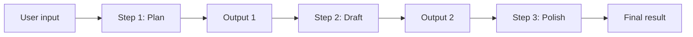

# Prompt Chaining

Prompt chaining runs **several LLM calls in sequence**. Each step gets a prompt; the model’s answer becomes **context for the next step**. You split one big task into smaller, focused prompts instead of asking for everything in one shot.

## Why chain prompts?

| Single mega-prompt | Prompt chain |
|--------------------|--------------|
| Model juggles many goals at once | Each step has one clear job |
| Hard to debug or fix one part | You can inspect output after each step |
| Output quality varies | Later steps refine earlier work |
| Expensive retries redo everything | Retry only the step that failed |

## Mental model



Each arrow between steps is: **previous output is injected into the next prompt** (often via a template variable like `{previous_output}`).

## Project layout

```
prompt_chaining/
├── src/
│   ├── chain.py      # ChainStep + PromptChain runner
│   ├── prompts.py    # Reusable prompt templates
│   └── llm.py        # LLM interface (mock + OpenAI)
└── examples/
    ├── basic_chain.py           # Mock LLM — no API key
    └── blog_writer_chain.py     # Outline → draft → edit
    └── real_llm_chain.py        # Same flow with OpenAI (needs API key)
```

## Quick start

```bash
cd prompt_chaining
python3 -m venv .venv
source .venv/bin/activate   # Windows: .venv\Scripts\activate
pip install -r requirements.txt

# Learn the pattern without an API key
python examples/basic_chain.py
python examples/blog_writer_chain.py

# Optional: real model (set OPENAI_API_KEY in .env)
python examples/real_llm_chain.py
```

## Core API (short)

- **`ChainStep`**: name + prompt template + optional `input_key` (which context field to read).
- **`PromptChain`**: ordered list of steps; `run(initial_context)` returns all step outputs.
- **`LLM`**: `complete(prompt) -> str`. Use `MockLLM` to learn; use `OpenAILLM` for production.

## When to use chaining vs other patterns

- **Chaining**: fixed pipeline (research → outline → write → review).
- **Routing**: pick *which* chain to run based on user intent.
- **Parallelization**: run independent steps at once, then merge.
- **Orchestrator–workers**: a planner LLM assigns dynamic subtasks.

This repo focuses on **linear chaining** only.

## Further reading

- [LangChain LCEL](https://python.langchain.com/docs/concepts/lcel/) — composable pipelines in production
- [OpenAI prompt engineering — decomposition](https://platform.openai.com/docs/guides/prompt-engineering)

## Troubleshooting: "I can't add files"

### 1. Open the repo root in Cursor

Use **File → Open Folder** and choose:

`.../Leaning/projects/prompt_chaining`

If you open the parent `projects` folder, Source Control may not show this repo.

### 2. Nothing new to add yet

If `git status` says **working tree clean**, all tracked files are already committed. Create or edit a file, **save it**, then it will appear under Source Control.

### 3. Some files are intentionally ignored

These will **not** stage with `git add` (by design):

| Path | Why |
|------|-----|
| `.env` | Secrets — never commit API keys |
| `.venv/`, `venv/` | Local Python environment |
| `__pycache__/`, `*.pyc` | Python cache |

Check if a file is ignored:

```bash
git check-ignore -v path/to/your/file
```

Use `.env.example` for templates; copy to `.env` locally (not committed).

### 4. Add and push a new file (terminal)

```bash
cd /path/to/prompt_chaining
# create or edit a file, then:
git add path/to/your_file.py
git status          # should list "Changes to be committed"
git commit -m "Add my new file"
git push
```

### 5. GitHub website vs local Git

Code is already on [GitHub](https://github.com/mulisriramreddy/prompt_chaining). Prefer editing locally and `git push`. If **Add file** on GitHub fails, sign in as the repo owner and ensure you are on the `main` branch.

If you still see an error, note the **exact message** (Cursor popup, terminal, or GitHub) — that pinpoints the fix.
