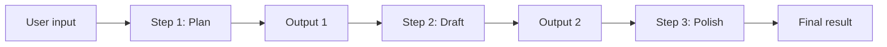

# Prompt Chaining

Prompt chaining runs **several LLM calls in sequence**. Each step gets a prompt; the model’s answer becomes **context for the next step**. You split one big task into smaller, focused prompts instead of asking for everything in one shot.

## Why chain prompts?

| Single mega-prompt | Prompt chain |
|--------------------|--------------|
| Model juggles many goals at once | Each step has one clear job |
| Hard to debug or fix one part | You can inspect output after each step |
| Output quality varies | Later steps refine earlier work |
| Expensive retries redo everything | Retry only the step that failed |

## Mental model



Each arrow between steps is: **previous output is injected into the next prompt** (often via a template variable like `{previous_output}`).

## Project layout

```
prompt_chaining/
├── src/
│   ├── chain.py      # ChainStep + PromptChain runner
│   ├── prompts.py    # Reusable prompt templates
│   └── llm.py        # LLM interface (mock + OpenAI)
└── examples/
    ├── basic_chain.py           # Mock LLM — no API key
    └── blog_writer_chain.py     # Outline → draft → edit
    └── real_llm_chain.py        # Same flow with OpenAI (needs API key)
```

## Quick start

```bash
cd prompt_chaining
python3 -m venv .venv
source .venv/bin/activate   # Windows: .venv\Scripts\activate
pip install -r requirements.txt

# Learn the pattern without an API key
python examples/basic_chain.py
python examples/blog_writer_chain.py

# Optional: real model (set OPENAI_API_KEY in .env)
python examples/real_llm_chain.py
```

## Core API (short)

- **`ChainStep`**: name + prompt template + optional `input_key` (which context field to read).
- **`PromptChain`**: ordered list of steps; `run(initial_context)` returns all step outputs.
- **`LLM`**: `complete(prompt) -> str`. Use `MockLLM` to learn; use `OpenAILLM` for production.

## When to use chaining vs other patterns

- **Chaining**: fixed pipeline (research → outline → write → review).
- **Routing**: pick *which* chain to run based on user intent.
- **Parallelization**: run independent steps at once, then merge.
- **Orchestrator–workers**: a planner LLM assigns dynamic subtasks.

This repo focuses on **linear chaining** only.

## Further reading

- [LangChain LCEL](https://python.langchain.com/docs/concepts/lcel/) — composable pipelines in production
- [OpenAI prompt engineering — decomposition](https://platform.openai.com/docs/guides/prompt-engineering)
